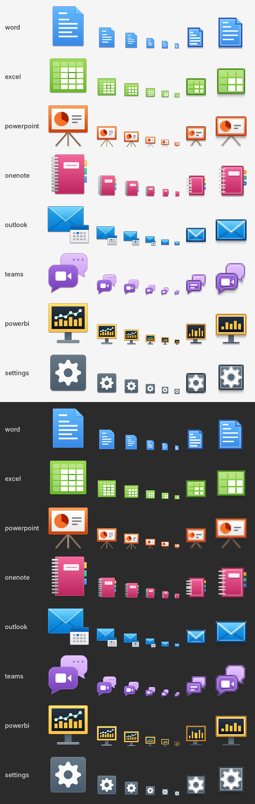

# Lucarne

Lucarne ouvre les applications web de Microsoft 365 (Word, Excel, PowerPoint, OneNote,
Outlook, Teams, Power BI) dans leurs propres fenêtres sur elementary OS. Chaque service a sa
fenêtre, son icône dans le dock, ses notifications système et son compteur de non-lus, comme
une application installée. Le contenu de la fenêtre est la page que Microsoft sert à un
navigateur : Lucarne n'imite pas Office et ne le remplace pas. Lucarne affiche ces pages
dans des fenêtres dédiées.

Une lucarne est une petite fenêtre percée dans un toit. Le projet est le pendant de
[Vasistas](https://github.com/melvincouwez-alt/vasistas), qui fait la même chose pour les
applications Windows d'une machine virtuelle.

Lucarne est un projet indépendant, non affilié à Microsoft. Voir [Marques](#marques).



## Ce que fait Lucarne

- Une fenêtre par service, avec une barre de titre elementary (à la couleur du service, ou
  neutre) et un `app_id` Wayland fixe (`lucarne-<appli>`) pour que le dock regroupe correctement
  les fenêtres.
- Une seule connexion Microsoft pour les sept fenêtres : les cookies de
  `login.microsoftonline.com` sont partagés entre les profils par un fichier lisible par vous
  seul.
- Notifications système avec un bouton « Ouvrir », pastilles de non-lus dans le dock.
- Une extension Chrome envoie les liens cliqués dans Chrome (documents SharePoint et OneDrive,
  Outlook, Teams, Power BI) à la fenêtre du service concerné.
- Teams : partage d'écran par le portail Wayland, micro antibruit (RNNoise), caméra infrarouge
  masquée dans la liste des caméras, appels entrants en notification avec boutons, statut
  depuis le panneau, plusieurs comptes, réglages pour les réseaux d'entreprise, bouton
  « Détacher » pour suivre un partage d'écran dans sa propre fenêtre.
- Une application « Réglages de Lucarne » (GTK 4 + Granite) : page d'accueil, fenêtre unique,
  notifications, démarrage automatique et style, service par service.
- Interface en français et en anglais. Lucarne utilise la langue du système, ou celle choisie
  dans les réglages.

## Installation

Téléchargez le `.deb` depuis les
[versions publiées](https://github.com/melvincouwez-alt/lucarne/releases) puis installez-le :

```sh
sudo apt install ./lucarne-<version>-linux-amd64.deb
```

Le paquet contient les fenêtres (`lucarne-app`), les commandes `lucarne` et
`lucarne-settings`, les lanceurs, les icônes et l'hôte de messagerie native pour Chrome. Il
remplace l'ancien paquet `microsoft365-elementary` ; au premier démarrage, les dossiers
`~/.config/m365-linux`, `~/.local/share/m365-linux` et `~/.cache/m365-linux` sont renommés en
`lucarne`, profils connectés compris.

Pour que Chrome envoie les liens à Lucarne, chargez l'extension une fois : ouvrez
`chrome://extensions`, activez le mode développeur, choisissez « Charger l'extension non
empaquetée » et indiquez `/opt/Lucarne/resources/desktop/extension`.

Lucarne est testé sur elementary OS 9 (Wayland). Il devrait aussi fonctionner sur les autres
distributions basées sur Debian ; l'application de réglages nécessite Granite 7.

## Compiler depuis les sources

```sh
cd shell
npm ci
npm run check       # vérification des types et tests sans lancer l'appli
npm run dist        # shell/release/lucarne-<version>-linux-amd64.deb
```

Pour développer sans le paquet, `./install.sh` crée les liens des commandes dans
`~/.local/bin` et écrit les lanceurs dans `~/.local/share/applications`. Sans `lucarne-app`,
la commande `lucarne` ouvre à la place une fenêtre Chrome `--app` qui passe par une page locale
fixe. Chaque service garde ainsi un `app_id` stable.

## Ligne de commande

```
lucarne <appli> [URL]                   ouvre un service (word, excel, powerpoint, onenote, outlook, teams, powerbi)
lucarne open <URL|ms-word:…|fichier>    choisit le service d'après l'adresse
lucarne link <appli> URL [fichier]      lien cliqué : en ligne, ou dans l'Office de Vasistas, selon les réglages
lucarne config get                      réglages en JSON
lucarne config set <appli> <clé> <valeur>
lucarne config set language auto|en|fr
lucarne status                          état en JSON (services, extension, Vasistas)
```

## Avec Vasistas

Les deux projets ne partagent aucun code et chacun fonctionne seul. Quand les deux sont
installés, ils communiquent uniquement par leurs commandes, que chacun cherche dans le `PATH`
au moment de l'appel. Aucun processus ne tourne en arrière-plan pour cette communication.

- De Lucarne vers Vasistas : quand un service est réglé sur « VM Windows », Lucarne transmet un
  document cliqué à `vasistas launch "ms-word:ofe|u|<adresse du fichier>"` (Office ouvre
  ensuite le fichier depuis cette adresse) et un fichier local à `vasistas open`. La variable
  `LUCARNE_VASISTAS` remplace la commande. Sans Vasistas, Lucarne masque ce choix dans les
  réglages et dans l'extension.
- De Vasistas vers Lucarne : la page « Navigateur » du compagnon Vasistas lit
  `lucarne status` et `lucarne config get`, et enregistre le choix avec
  `lucarne config set <appli> target vm|web`.

## Organisation du dépôt

| Chemin | Contenu |
|---|---|
| `shell/` | Application Electron (TypeScript). Un processus par service : `lucarne-app --lucarne-app=<id> [URL]`. |
| `bin/lucarne` | Commande principale : ouvre un service, choisit le service d'une adresse, sert d'interface aux autres programmes. |
| `bin/lucarne-settings` | Application de réglages. |
| `bin/lucarne-native-host` | Hôte de messagerie native pour l'extension Chrome. |
| `bin/lucarne_config.py`, `bin/lucarne_i18n.py` | `~/.config/lucarne/config.json`, traductions. |
| `bin/lucarne-desktop-files` | Écrit les lanceurs `.desktop` (utilisé par `install.sh` et le paquet). |
| `extension/` | Extension Chrome (Manifest V3). |
| `icons/deux_plans.py` | Dessine les icônes des services : une tuile de couleur derrière, un objet blanc devant. |
| `icons/lucarne_icons.py` | Point d'entrée des icônes, et icône des réglages. |

## Notes de développement

- Pour tester sans modifier votre profil réel : `HOME=<dossier jetable> LUCARNE_DEV_PROBE=/chemin.png
  shell/release/linux-unpacked/lucarne-app --no-sandbox --lucarne-app=outlook`. Ne lancez jamais
  cette commande avec un `HOME` vide : Electron utilise alors votre profil réel.
- Tout code injecté dans Teams doit construire ses éléments nœud par nœud. La page impose les
  Trusted Types : `innerHTML` et `document.write` y lèvent une erreur.

## Licence

GPL-3.0 ou ultérieure, voir [LICENSE](LICENSE). Lucarne contient du code sous GPL-3.0
(teams-for-linux, le greffon RNNoise). Les sources et crédits sont listés dans
[CREDITS.md](CREDITS.md).

## Marques

Microsoft, Microsoft 365, Office, Word, Excel, PowerPoint, OneNote, Outlook, Teams, Power BI,
SharePoint et OneDrive sont des marques de Microsoft Corporation. Lucarne est un projet
indépendant, non affilié à Microsoft et non approuvé par Microsoft. Ces noms servent seulement
à indiquer quel service s'ouvre dans quelle fenêtre. Les icônes sont des dessins originaux créés
pour le projet : elles ne reprennent ni les logos ni les lettres de Microsoft, et leurs couleurs
viennent de la palette d'elementary OS (Outlook a un bleu denim propre au projet, pour ne pas
être confondu avec Word). Lucarne ne contient ni code, ni image, ni police de Microsoft.
